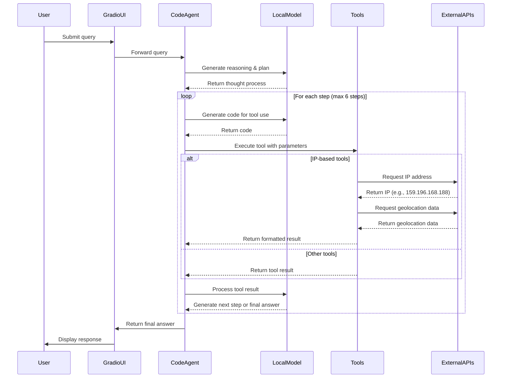

# Agent Request Workflow

This document describes the workflow of how the agent processes user requests, from initial input to final response.

## Overview

The agent is built using the `smolagents` framework and follows a structured workflow to process user requests. It uses a local language model (Qwen2.5-Coder-7B-Instruct) to generate responses and has access to various tools to perform specific tasks.

## Workflow Diagram

## Detailed Workflow Steps

### 1. User Input Processing

1. **User Interaction**: 
   - User submits a query through the Gradio web interface
   - The query is captured by the `interact_with_agent` method in the `GradioUI` class

2. **Query Forwarding**:
   - The Gradio UI forwards the query to the CodeAgent
   - The agent's `run` method is called with the user's query

### 2. Agent Planning and Reasoning

1. **Initial Reasoning**:
   - The CodeAgent sends the user query to the LocalModel
   - The model generates a "Thought" section explaining its reasoning
   - This reasoning is captured as the first step in the agent's workflow

2. **Tool Selection**:
   - Based on the reasoning, the model decides which tool to use
   - It generates Python code to call the appropriate tool

### 3. Tool Execution

1. **Tool Calling**:
   - The agent executes the generated Python code
   - This code calls one of the available tools:
     - `get_local_time_from_ip()`: Gets user's local time based on IP geolocation
     - `get_current_time_in_timezone(timezone)`: Gets time for a specific timezone
     - `image_generation_tool`: Generates images from text descriptions
     - `final_answer`: Provides the final response to the user

2. **External API Interactions** (for IP-based tools):
   - The tool makes a request to `https://demo.52dayday.com/myip` to get the user's IP
   - It then queries `http://ip-api.com/json/{ip_address}` to get geolocation data
   - The geolocation data includes country, region, city, timezone, etc.
   - For timezone tools, the appropriate timezone is determined and the current time is calculated

3. **Result Processing**:
   - The tool returns its result to the agent
   - The result is logged with detailed information about each step

### 4. Response Generation

1. **Observation Processing**:
   - The agent captures the tool's output as an "Observation"
   - This observation is sent to the model along with the previous context

2. **Next Step Determination**:
   - The model processes the observation and decides on the next step
   - It can either:
     - Generate code to call another tool
     - Provide a final answer using the `final_answer` tool

3. **Iteration**:
   - Steps 2-4 repeat until the agent reaches a final answer or hits the maximum step limit (6 steps)

### 5. Final Response

1. **Final Answer Generation**:
   - When the model decides it has enough information, it calls the `final_answer` tool
   - The final answer incorporates the information gathered from previous tool calls

2. **Response Formatting**:
   - The Gradio UI formats the response with proper styling
   - Each step of the agent's reasoning is displayed to the user
   - The final answer is prominently shown

3. **User Display**:
   - The formatted response is displayed to the user in the Gradio interface
   - The user can see the agent's thought process, tool calls, and final answer

## Logging and Monitoring

Throughout this process, detailed logging occurs:

- **Function Calls**: Each tool logs when it's called and with what parameters
- **API Requests**: External API requests are logged with their responses
- **Error Handling**: Any errors during the process are captured and logged
- **Results**: The results of each step are logged for debugging and monitoring

## Example: Local Time Request

When a user asks "What is my local time?", the workflow is:

1. User submits the query through Gradio UI
2. Agent reasons that it needs to determine the user's location
3. Agent generates code to call `get_local_time_from_ip()`
4. The tool:
   - Requests the user's IP from demo.52dayday.com/myip
   - Gets geolocation data from ip-api.com
   - Extracts the timezone information
   - Calculates the current time in that timezone
5. Agent receives the local time information
6. Agent generates a final answer incorporating the local time
7. The response is displayed to the user showing both the reasoning and the final answer

This workflow ensures that the agent can effectively process user requests, use appropriate tools, and provide informative responses based on real-time data. 

Check out the configuration reference at https://huggingface.co/docs/hub/spaces-config-reference
